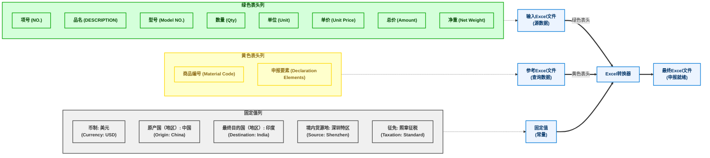

# Excel 报关单转换器

一个用于报关目的的 Excel 文件转换 Python 应用程序，通过组合多个数据源并添加固定值来生成最终文档。

## 概述

该应用程序帮助准备出口报关单，通过以下步骤：
1. 读取输入 Excel 文件（带有绿色表头的源数据）
2. 通过物料代码与参考 Excel 文件匹配（获取黄色表头数据）
3. 按报关要求添加固定值
4. 输出格式正确的 Excel 文件，可直接提交使用

## 功能特点

- **保留原始数据**：保持源文件中的关键数据（绿色表头）
- **物料代码匹配**：通过物料代码匹配产品，添加申报字段（黄色表头）
- **固定值**：自动添加标准化值（币制、原产国等）
- **用户友好界面**：使用 Streamlit 构建的简单网页界面，易于使用
- **命令行支持**：可通过命令行使用，支持批处理

## 使用方法

### 网页界面

使用该应用程序最简单的方法是通过 Streamlit 网页界面：

```bash
streamlit run streamlit_app.py
```

通过网页界面，您可以：
1. 上传输入 Excel 文件（带有绿色表头）
2. 上传参考 Excel 文件（包含物料代码和申报数据）
3. 指定输出文件名
4. 在转换前预览数据
5. 下载转换后的文件

### 命令行

对于批处理或自动化，使用命令行界面：

```bash
python excel_converter.py input.xlsx reference.xlsx output.xlsx
```

## 配置

该应用程序使用配置文件（`config.py`）来确定要包含的列：

### 绿色表头（保留列）
- 项号 (NO.)
- 品名 (DESCRIPTION)
- 型号 (Model NO.)
- 数量 (Qty)
- 单位 (Unit)
- 单价 (Unit Price)
- 总价 (Amount)
- 净重 (net weight)

### 黄色表头（匹配列）
- 商品编号 (Material Code)
- 申报要素 (Declaration Elements)

### 固定值
- 币制: 美元 (Currency: USD)
- 原产国（地区）: 中国 (Country of Origin: China)
- 最终目的国（地区）: 印度 (Destination Country: India)
- 境内货源地: 深圳特区 (Domestic Source: Shenzhen Special Zone)
- 征免: 照章征税 (Taxation: According to regulations)

## 处理流程



## 系统要求

- Python 3.6+
- pandas
- openpyxl
- streamlit (用于网页界面)

## 安装

```bash
pip install pandas openpyxl streamlit
```

## 许可证

本项目为专有软件，仅供内部使用。 