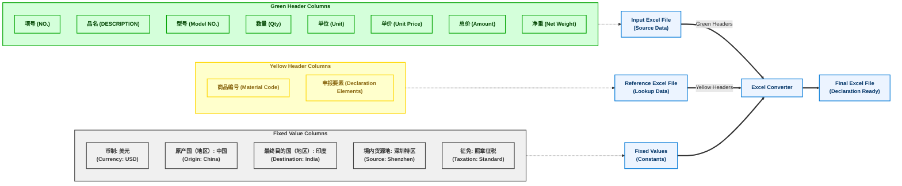

# Excel Converter for Declaration List

A Python application that converts Excel files for declaration purposes by combining data from multiple sources and adding fixed values.

## Overview

This application helps in preparing export declaration lists by:
1. Reading data from an input Excel file (source data with green headers)
2. Matching material codes with a reference Excel file (to obtain yellow headers data)
3. Adding fixed values as required for declaration purposes
4. Outputting a properly formatted Excel file ready for submission

## Features

- **Preserve Original Data**: Maintains essential data from the source file (green headers)
- **Material Code Matching**: Matches products by material code to add declaration fields (yellow headers)
- **Fixed Values**: Automatically adds standardized values (currency, origin country, etc.)
- **User-Friendly Interface**: Simple web interface built with Streamlit for easy use
- **Command Line Support**: Can be used via command line for batch processing

## Usage

### Web Interface

The simplest way to use the application is through the Streamlit web interface:

```bash
streamlit run streamlit_app.py
```

Through the web interface, you can:
1. Upload your input Excel file (with green headers)
2. Upload your reference Excel file (with material codes and declaration data)
3. Specify an output filename
4. Preview the data before conversion
5. Download the converted file

### Command Line

For batch processing or automation, use the command line interface:

```bash
python excel_converter.py input.xlsx reference.xlsx output.xlsx
```

## Configuration

The application uses a configuration file (`config.py`) to determine which columns to include:

### Green Headers (Preserved Columns)
- 项号 (NO.)
- 品名 (DESCRIPTION)
- 型号 (Model NO.)
- 数量 (Qty)
- 单位 (Unit)
- 单价 (Unit Price)
- 总价 (Amount)
- 净重 (net weight)

### Yellow Headers (Matched Columns)
- 商品编号 (Material Code)
- 申报要素 (Declaration Elements)

### Fixed Values
- 币制: 美元 (Currency: USD)
- 原产国（地区）: 中国 (Country of Origin: China)
- 最终目的国（地区）: 印度 (Destination Country: India)
- 境内货源地: 深圳特区 (Domestic Source: Shenzhen Special Zone)
- 征免: 照章征税 (Taxation: According to regulations)

## Process Flow



## Testing

The project includes a comprehensive test suite to ensure reliability and correct functionality. The tests are organized in the `tests/` directory.

### Test Structure

- `tests/test_excel_converter.py` - Tests for the core Excel conversion functionality
- `tests/test_config.py` - Tests for the configuration settings
- `tests/test_streamlit_app.py` - Tests for the Streamlit web interface
- `tests/conftest.py` - Common fixtures and setup for all tests

### Running Tests

To run the tests, you'll need to install the test dependencies:

```bash
pip install -r requirements-test.txt
```

Then, run the tests using pytest:

```bash
pytest
```

For more detailed output, use:

```bash
pytest -v
```

To generate a test coverage report:

```bash
pytest --cov=. --cov-report=html
```

This will create an HTML coverage report in the `htmlcov/` directory.

## Requirements

- Python 3.6+
- pandas
- openpyxl
- streamlit (for web interface)

## Installation

```bash
pip install pandas openpyxl streamlit
```

## License

This project is proprietary and intended for internal use only.