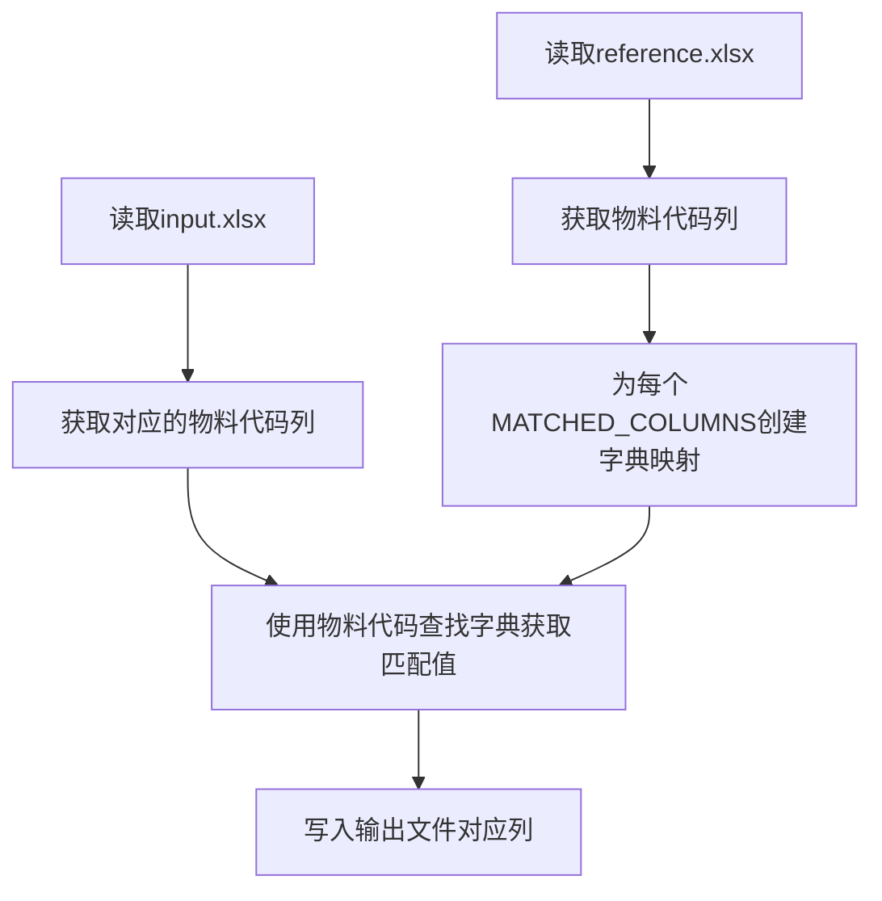

```mermaid
flowchart TD
    A[读取reference.xlsx] --> B[获取物料代码列]
    B --> C[为每个MATCHED_COLUMNS创建字典映射]
    D[读取input.xlsx] --> E[获取对应的物料代码列]
    E --> F[使用物料代码查找字典获取匹配值]
    C --> F
    F --> G[写入输出文件对应列]
```